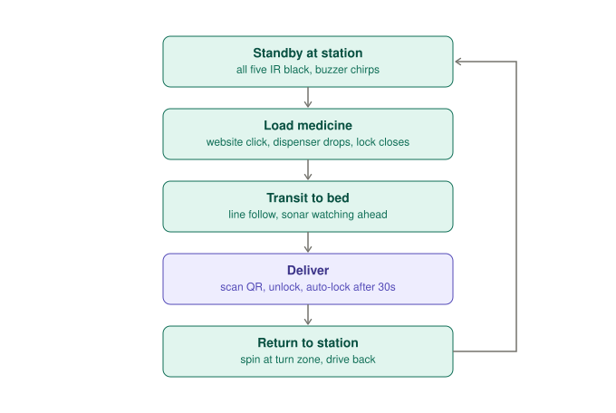
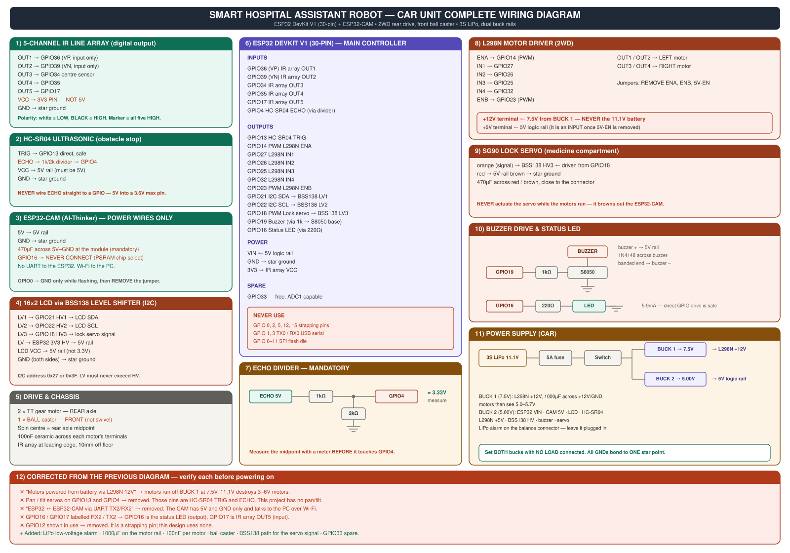

# Smart Hospital Assistant Robot

Autonomous medicine delivery using two independent units coordinated over Wi-Fi.

A line-following **car** collects medicine from a fixed **glove-box dispenser**, transports it to a patient bed, verifies the bed by QR code, and releases the medicine only after verification. It re-locks automatically after 30 seconds and returns to the station.



### Car unit — complete wiring



---

## Documentation

| Doc | Covers |
|---|---|
| [01 — Overview and features](docs/01-overview-and-features.md) | What it does, 24-item feature list, operating sequence, architecture |
| [02 — Bill of materials](docs/02-bill-of-materials.md) | Every part, quantity, and why it's there |
| [03 — Power system](docs/03-power-system.md) | Battery, buck converters, rails, decoupling, star ground |
| [04 — Chassis and mechanical](docs/04-chassis-and-mechanical.md) | Drive geometry, ball caster, mounting, weight distribution |
| [05 — Car wiring](docs/05-car-wiring.md) | Complete pin table and component-by-component wiring |
| [06 — Dispenser wiring](docs/06-dispenser-wiring.md) | Complete wiring for the stationary unit |
| [07 — Track and navigation](docs/07-track-and-navigation.md) | Tape layout, QR placement, navigation logic, the 180° spin |
| [08 — Software and API](docs/08-software-and-api.md) | REST endpoints, QR verification, state machine, failure modes |
| [09 — Assembly and calibration](docs/09-assembly-and-calibration.md) | Bring-up order and every calibration procedure |
| [10 — Troubleshooting](docs/10-troubleshooting.md) | 22 symptoms mapped to causes and fixes, plus all warnings |
| [Pinout reference](hardware/pinout-reference.md) | One-page GPIO map for both boards |

---

## Hardware

| Unit | Boards | Power |
|---|---|---|
| **Car** (mobile) | ESP32 DevKit V1 (30-pin) + ESP32-CAM | 3S LiPo → two LM2596 (7.5V motors, 5.0V logic) |
| **Dispenser** (fixed) | ESP32 DevKit V1 (30-pin) | 5V 2A USB adapter |

Drive: two TT gear motors at the rear, one ball caster at the front.
Sensing: 5-channel digital IR line array, HC-SR04 ultrasonic, ESP32-CAM.

```
Browser ──HTTP──> Flask on PC ──HTTP──> Car ESP32         (static IP)
                               ├──HTTP──> Dispenser ESP32  (static IP)
                               └──HTTP──> ESP32-CAM        (static IP)
```

No wires run between the two units.

---

## How it works

1. Nurse selects a bed on the web page and clicks dispense.
2. Dispenser servo opens; medicine drops into the car's compartment.
3. Car locks the compartment and drives off, following the line.
4. Car stops at **every** black marker, photographs the QR, and the PC decodes it.
5. Wrong bed → keep driving. Right bed → unlock, buzzer, LCD confirmation.
6. After 30 seconds the compartment auto-locks.
7. Car continues to the turn zone, spins 180°, and returns to the station.

The QR is the **only** thing that identifies a location. There is no counter and no position estimate, so the car cannot silently drift to the wrong bed.


---

## Safety behaviours

| Situation | Response |
|---|---|
| Scanned QR ≠ target bed | Compartment stays locked, car moves on |
| Target QR missing or damaged | Car reaches turn zone, spins, returns **still locked** |
| QR unreadable | Nurse verifies via live camera stream and confirms manually |
| Obstacle within 25cm | Immediate stop, resumes when clear |
| Spin fails to re-acquire the line | Fault — the car will not drive blind |

---

## Before you build

Read [03 — Power system](docs/03-power-system.md) first. Three mistakes in this build cause permanent damage:

1. **Feeding the L298N 11.1V directly** — the 3–6V motors burn out in minutes
2. **Connecting HC-SR04 ECHO straight to a GPIO** — 5V into a 3.6V-max pin
3. **Powering the IR array at 5V** — same problem, on five pins at once

All three are solved in the docs. None are optional. See the [warning summary](docs/10-troubleshooting.md#2-warning-summary).

---

## Repository layout

```
docs/            Build documentation
docs/diagrams/   SVG wiring and layout diagrams
firmware/car/          Arduino sketch — car controller
firmware/dispenser/    Arduino sketch — dispenser controller
firmware/esp32-cam/    Arduino sketch — camera server
hardware/        Pinout reference
pc/              Flask control page and QR decoder
```

## Status

Documentation complete. Firmware in progress.
