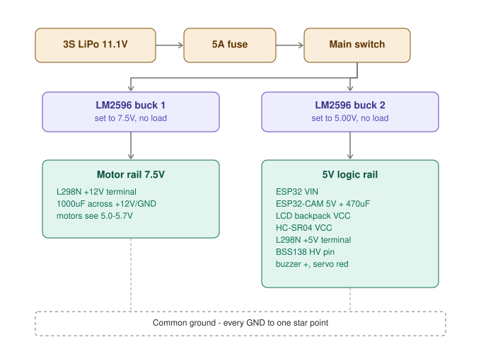

# Power System

## 1. Power system




Read this section before wiring anything. Two of the three permanent-damage mistakes in this build are power mistakes.

### 1.1 Car power tree

```
LiPo 3S (11.1V) ─ 5A fuse ─ switch ─┬─ LM2596 #1 ─ 7.5V ─ L298N +12V
                                     └─ LM2596 #2 ─ 5.0V ─ logic rail
```

**Why two bucks.** One converter outputs one voltage, and you need two. A single 5V buck would leave the motors at ~3V after the L298N's drop — barely enough to start. A single 7.5V buck would feed 7.5V to the ESP32-CAM, LCD, and HC-SR04, all of which expect 5V.

**Why 7.5V and not 11.1V direct.** The L298N drops 1.8–2.5V across its output transistors, so 7.5V in puts about **5.0–5.7V** on the motors — inside their 3–6V rating. Feeding 11.1V would put ~9.3V on 6V motors: they overheat, the magnets demagnetise, and the gearbox strips. Dead within minutes.

### 1.2 5V logic rail budget

| Load | Typical | Peak |
|---|---|---|
| ESP32 DevKit (Wi-Fi active) | 80 mA | 250 mA |
| ESP32-CAM (Wi-Fi + capture) | 180 mA | 310 mA |
| 16×2 LCD + backlight | 25 mA | 30 mA |
| 5-channel IR array | 20 mA | 100 mA |
| HC-SR04 | 2 mA | 15 mA |
| L298N logic side | 20 mA | 36 mA |
| Buzzer + LED | 40 mA | 45 mA |
| SG90 lock servo | 0 mA | 700 mA |
| **Total** | **~367 mA** | **~1.49 A** |

An LM2596 handles 2A continuous. The servo peak only occurs when the car is stopped and the motors draw nothing.

> **Firmware constraint that makes this safe:** never command the servo while the motors run. Enforce it structurally — only `LOCKING`, `DELIVERING`, and `AUTOLOCK` may touch the servo, and all three zero the motors on entry.

### 1.3 Buck calibration — do this first, with no load attached

1. Connect `IN+`/`IN−` to the pack. Leave `OUT+`/`OUT−` **completely unconnected**.
2. Put a multimeter across `OUT+`/`OUT−`.
3. Turn the blue trimmer. It is multi-turn — expect many rotations.
4. Buck #1 → exactly **7.5V**. Buck #2 → **5.00V**.
5. Disconnect the input, wire the output, then re-verify under load.
6. If the 5V rail sags below 4.75V under load, the module cannot supply the current.

### 1.4 Required capacitors

| Value | Location | Why |
|---|---|---|
| 1000µF | Across L298N `+12V`/`GND` terminals | Motors are inductive. Starting them yanks current, stopping them dumps back-EMF. Without bulk capacitance the 7.5V rail collapses and can reset the whole car. |
| 470µF | Across ESP32-CAM `5V`/`GND`, within 20mm of the module | The module jumps from ~180mA to 310mA+ in microseconds when Wi-Fi transmits. The buck's feedback loop needs ~100µs to react and the wire between has inductance — so the module browns out and reboots in a loop **that looks exactly like a dead board**. The single most common ESP32-CAM failure. |
| 470µF | Across servo red/brown | Absorbs SG90 inrush |
| 100nF ceramic | At LCD, HC-SR04, ESP32-CAM VCC/GND | High-frequency decoupling — electrolytics are too slow and too inductive for this |
| 100nF ceramic | Soldered across each motor's terminals, at the motor body | Brush arcing generates broadband RF that corrupts IR readings and can crash the ESP32 |

Watch electrolytic polarity. Reversed electrolytics vent.

### 1.5 Star ground — mandatory

Every ground meets at **one physical point** — a screw terminal block or a dedicated rail, with short thick wires.

Bond to it: pack negative, both LM2596 `IN−` and `OUT−`, L298N `GND` screw terminal, ESP32 DevKit `GND`, ESP32-CAM `GND`, BSS138 `GND` (both sides), all sensor grounds, S8050 emitter, servo brown wire.

### 1.6 Dispenser power

```
5V 2A USB adapter ──┬── ESP32 VIN
                    └── SG90 red
```

**Use a mains adapter, not a battery.** The dispenser never moves. No charging cycle, no cutoff voltage to watch, nothing flammable sitting on a shelf overnight.

If it must run untethered: 3S LiPo → fuse → switch → LM2596 at 5.0V. Budget ESP32 250mA peak + SG90 700mA stall ≈ 950mA, inside the 2A rating. Add 470µF across the buck output.

### 1.7 Battery safety

A 3S LiPo can deliver **50–100A into a short**. One pinched wire against the chassis with no fuse means melted insulation and a real fire risk. The 5A fuse opens long before that.

The LiPo alarm plugs into the balance connector and buzzes at ~3.3V/cell. Below 3.0V/cell the pack is permanently damaged; below ~2.5V it can ignite on the next charge.

Unlike firmware, **the alarm still works when the ESP32 has crashed.** Leave it plugged in whenever the pack is connected.
