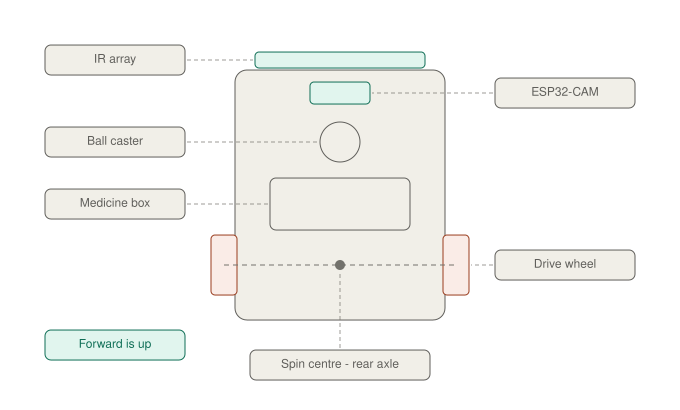

# Chassis and Mechanical Layout

## 1. Chassis and mechanical layout




### 1.1 Geometry

Two driven wheels at the **rear**, one caster at the **front**. The robot pivots about the midpoint of the rear axle — not about its centre.

```
        ┌──────────────────┐
        │   IR array       │  ← leading edge, 10mm off floor
        │   ESP32-CAM      │
        │   ( caster )     │
        │                  │
        │  ┌────────────┐  │
        │  │ medicine   │  │
        │  │ box + lock │  │
        │  └────────────┘  │
       ═╪══════●═══════════╪═  ← drive axle, ● = spin centre
        └──────────────────┘
              forward ↑
```

### 1.2 Use a ball caster, not a swivel caster

A **swivel caster** must rotate 180° every time the robot reverses direction — which is exactly what your turnaround does. It fights the spin, drags, and stutters, which desynchronises your spin timing calibration.

A **ball caster** (metal or nylon ball in a socket) has no orientation at all and handles spins cleanly.

### 1.3 Consequences of the front-caster layout

| Effect | Consequence | What to do |
|---|---|---|
| Sensor is far from the pivot | Small heading errors swing the array a lot — high gain, oscillation-prone | Use a **lower** proportional gain than a rear-caster robot would need |
| Front sweeps a wide arc during the spin | Needs clearance ≈ full robot length as a radius | Give the turn zone 25cm+ clearance on both sides |
| Array crosses the line fast during the spin | Phase 3 can sweep past before the sensor registers | Run spin phase 3 at **35% PWM**, not 45% |

If your chassis kit allows the motor bracket at either end, **mounting the motors at the front and the caster at the rear is the standard line-follower geometry** and is easier to tune. Both work; the front-caster version needs more patience with PID.

### 1.4 Three mechanical checks

**Caster height must match the drive wheel radius.** Your IR array has no trimpots — mounting height is your only sensing adjustment. A 2mm-short caster tilts the chassis, changes the array height, and shifts your black/white threshold. Shim until the chassis sits level, *then* set the array height.

**Put the battery over or slightly behind the drive axle.** Weight forward means the drive wheels lose traction. Slip breaks both line following and spin calibration.

**Account for the stop offset.** The array sits at the front but the medicine compartment sits in the middle. When the array detects the station marker, the box is still short of the chute. Measure that distance once and add a fixed post-marker creep before stopping at `STATION`.

### 1.5 Mounting

| Component | Placement |
|---|---|
| IR array | Leading edge, 10mm off the floor, rigid bracket, perpendicular to the floor and square to travel |
| ESP32-CAM | Front, facing forward and slightly down, mounted rigidly — motion blur is the top cause of QR failures |
| Medicine box | Centre, over or just ahead of the drive axle |
| LiPo pack | Over or slightly behind the drive axle |
| HC-SR04 | Front-facing, on standoffs, at least 20mm above the chassis floor to avoid ground reflections |
| LCD | Top surface, angled for readability |
