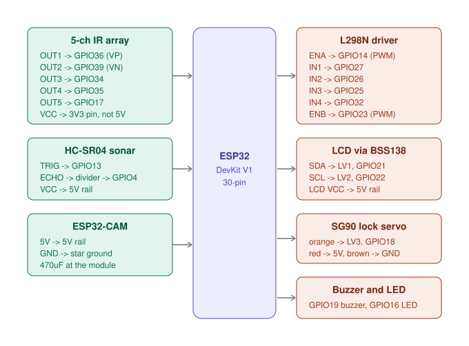
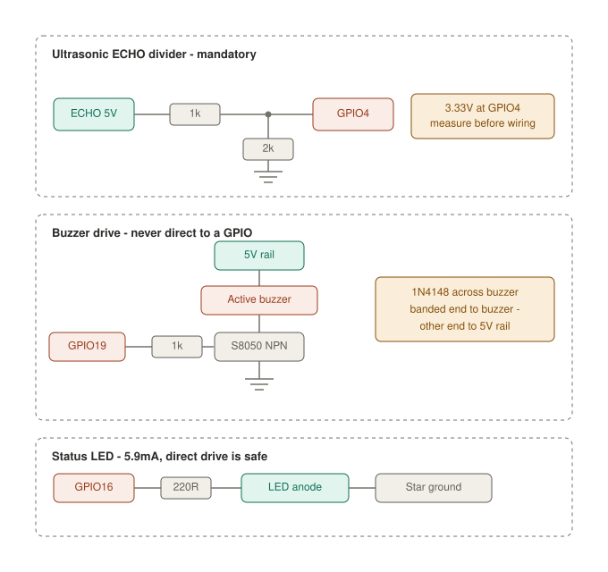

# Car Wiring

## 1. Car — complete pin table





Board: **DOIT ESP32 DevKit V1, 30-pin.**
Left header top→bottom: `EN, VP, VN, D34, D35, D32, D33, D25, D26, D27, D14, D12, D13, GND, VIN`
Right header top→bottom: `D23, D22, TX0, RX0, D21, D19, D18, D5, TX2, RX2, D4, D2, D15, GND, 3V3`

| ESP32 pin | GPIO | Direction | Connects to | Notes |
|---|---|---|---|---|
| `VP` | 36 | Input only | Array `OUT1` | Leftmost sensor |
| `VN` | 39 | Input only | Array `OUT2` | |
| `D34` | 34 | Input only | Array `OUT3` | Centre sensor |
| `D35` | 35 | Input only | Array `OUT4` | |
| `TX2` | 17 | Input | Array `OUT5` | Rightmost sensor |
| `D14` | 14 | Output PWM | L298N `ENA` | Left motor speed |
| `D27` | 27 | Output | L298N `IN1` | Left dir A |
| `D26` | 26 | Output | L298N `IN2` | Left dir B |
| `D25` | 25 | Output | L298N `IN3` | Right dir A |
| `D32` | 32 | Output | L298N `IN4` | Right dir B |
| `D23` | 23 | Output PWM | L298N `ENB` | Right motor speed |
| `D13` | 13 | Output | HC-SR04 `TRIG` | Direct, safe |
| `D4` | 4 | Input | ECHO divider midpoint | **Divider mandatory** |
| `D21` | 21 | Bidirectional | Shifter `LV1` → LCD `SDA` | |
| `D22` | 22 | Output | Shifter `LV2` → LCD `SCL` | |
| `D18` | 18 | Output PWM | Shifter `LV3` → SG90 orange | Lock servo |
| `D19` | 19 | Output | 1kΩ → S8050 base | Buzzer |
| `D16` | 16 | Output | 220Ω → LED anode | Status |
| `D33` | 33 | — | **SPARE** (ADC1 capable) | Battery monitor *or* box sensor *or* second LED — pick one |
| `VIN` | — | Power in | 5V logic rail | |
| `GND` | — | Ground | Star ground | |
| `3V3` | — | Power **out** | Array `VCC` | ~20–100mA |

**Never connect:** GPIO 0, 2, 5, 12, 15 (strapping pins), GPIO 1/3 (TX0/RX0, USB serial), GPIO 6–11 (SPI flash, not broken out on this board).

This design touches **zero strapping pins**, so the board boots reliably regardless of what your peripherals are doing at power-on.

---

## 2. Car — component wiring

### 2.1 Line sensor array — 5-channel, digital

Datasheet: 3.3–5V operating, 20mA typical, digital High/Low output, 2–30cm detection range, no trimpots.

| Array pin | Connects to |
|---|---|
| `VCC` | ESP32 **`3V3` pin** — see warning below |
| `GND` | Star ground |
| `OUT1` | GPIO36 (`VP`) |
| `OUT2` | GPIO39 (`VN`) |
| `OUT3` | GPIO34 |
| `OUT4` | GPIO35 |
| `OUT5` | GPIO17 |

**Power from 3.3V, not 5V.** The datasheet supports both, but at 5V the outputs swing to 5V — over the ESP32's 3.6V absolute maximum, on five pins at once. At 3.3V they are safe by construction: no dividers, no level shifter, no extra parts.

#### Output polarity — verify before writing logic

Per the datasheet: **LOW = object detected, HIGH = not detected.**

| Surface | IR behaviour | Output |
|---|---|---|
| White floor | Reflects → detected | **LOW (0)** |
| Black tape | Absorbs → not detected | **HIGH (1)** |

So your all-black marker is **all five channels reading HIGH**, and the centre sensor tracking the line also reads HIGH.

This is inverted from what most people assume, and roughly half of these boards are documented backwards. **Run a five-channel print sketch first** and slide the array over line and floor before you write a single line of navigation logic.

#### Mounting — the only adjustment you have

No trimpots means the switching threshold is fixed in hardware. Mounting height is your sole tuning knob.

- Start at **10mm**, adjust between 5mm and 20mm for clean, repeatable transitions
- Rigid bracket — flex changes height, which changes readings
- Perpendicular to the floor, square to the direction of travel
- Ambient light affects IR sensors. Test under the lighting you will demo in.

**Current draw:** 20mA typical per datasheet; budget up to 100mA if that figure is per-sensor. Either way, well within the DevKit's AMS1117-3.3 capacity.

### 2.2 L298N motor driver

Jumper setup: **remove `ENA`, remove `ENB`, remove `5V-EN`.**

With `5V-EN` removed, the `+5V` screw terminal becomes an **input** — feed it from the logic rail. The onboard 78M05 is marginal at 7.5V input (it needs ~7V dropout) and runs hot.

| L298N | Connects to |
|---|---|
| `+12V` | LM2596 #1 `OUT+` (7.5V) |
| `GND` | Star ground |
| `+5V` | 5V logic rail (**input** now) |
| `ENA` | GPIO14 |
| `IN1` | GPIO27 |
| `IN2` | GPIO26 |
| `IN3` | GPIO25 |
| `IN4` | GPIO32 |
| `ENB` | GPIO23 |
| `OUT1`/`OUT2` | Left motor |
| `OUT3`/`OUT4` | Right motor |

**Level safety: SAFE, no shifter needed.** The L298 die specifies logic HIGH from 2.3V minimum; the ESP32's 3.3V clears it with margin. The module is often described as "5V logic" — that refers to its supply, not its input threshold.

**Never** feed the `+5V` terminal while the `5V-EN` jumper is still installed — you would be back-driving the regulator's output.

**Thermal note:** at 7.5V and ~400mA per motor the heatsink gets warm but not hot. Too hot to touch means the motors are stalling — check for mechanical binding.

### 2.3 HC-SR04 ultrasonic

| Pin | Connects to |
|---|---|
| `VCC` | 5V logic rail — **must be 5V**, range collapses at 3.3V |
| `GND` | Star ground |
| `TRIG` | GPIO13 direct |
| `ECHO` | Divider midpoint → GPIO4 |

```
ECHO ──┬── 1kΩ ──┬── GPIO4
       │         │
       │       2kΩ
       │         │
       │        GND
```

5V × 2000/3000 = **3.33V**. **Measure this midpoint with a multimeter before connecting it to GPIO4.** Ten seconds of checking prevents an unrecoverable pin failure.

**Why GPIO4 and not GPIO12:** GPIO12 is the MTDI strapping pin and must be LOW at boot. A stray echo pulse during reset would set the flash regulator to 1.8V and soft-brick the board.

Do not use divider values above ~20kΩ total — the RC time constant with GPIO input capacitance rounds off the echo edge and corrupts distance readings.



### 2.4 Level shifter, LCD, servo, buzzer, LED

| Component | Pin | Connects to |
|---|---|---|
| BSS138 | `LV` | ESP32 `3V3` |
| | `HV` | 5V logic rail |
| | `GND` ×2 | Star ground |
| | `LV1`/`HV1` | GPIO21 / LCD `SDA` |
| | `LV2`/`HV2` | GPIO22 / LCD `SCL` |
| | `LV3`/`HV3` | GPIO18 / servo orange |
| | `LV4`/`HV4` | Unconnected (spare) |
| LCD backpack | `VCC` | 5V logic rail — **not 3.3V**, the HD44780 bias needs 5V |
| | `GND` | Star ground |
| SG90 lock | Brown | Star ground |
| | Red | 5V logic rail |
| | Orange | Shifter `HV3` |
| Buzzer | `+` | 5V logic rail |
| | `−` | S8050 collector |
| S8050 | Base | 1kΩ from GPIO19 |
| | Emitter | Star ground |
| 1N4148 | Anode | 5V rail |
| | Cathode (banded) | Buzzer `−` |
| LED | Anode | 220Ω from GPIO16 |
| | Cathode | Star ground |

**`LV` must never sit higher than `HV`.** Power both rails from the same switch so they rise together, or current flows backwards through the MOSFET body diodes.

**Why the LCD needs the shifter:** the I2C backpack has 4.7kΩ pull-ups to its own 5V supply, so SDA and SCL idle at 5V into the ESP32.

*Alternative if you cannot source a BSS138:* desolder the backpack's two pull-up resistors and fit your own 4.7kΩ to **3.3V**, then wire SDA/SCL direct. The PCF8574 outputs are open-drain, so the bus then never exceeds 3.3V.

**I2C address:** usually `0x27` (PCF8574) or `0x3F` (PCF8574A). Run a scanner sketch first.

**LCD contrast:** the blue trimpot on the backpack. On first power-up expect a blank screen or a row of solid blocks — turn until characters appear. This is normal.

**LED current:** (3.3 − 2.0) / 220 = 5.9mA. Well under the 20mA limit, safe for direct GPIO drive.

**Why the buzzer needs a transistor:** a 5V active buzzer draws 25–35mA, at or over the ESP32's 20mA per-pin recommendation. The 1N4148 clamps the reverse spike when the transistor switches off.

**S8050 pinout** (flat face toward you, legs down): E–B–C left to right. Verify against your part — some clones are C–B–E. Wrong pinout means the buzzer never sounds; with the base resistor fitted, nothing is damaged.

**SG90 mechanical:** nylon gears strip easily. Add end stops so the horn cannot be driven past its travel, and design the latch so the servo never holds torque against a jam. Use the `ESP32Servo` library — the standard Arduino `Servo` library does not work on ESP32. 50Hz, 500–2400µs.

### 2.5 ESP32-CAM

**Runtime — two wires only:**

| ESP32-CAM | Connects to |
|---|---|
| `5V` | 5V logic rail |
| `GND` | Star ground |
| Everything else | **Unconnected** |

**`GPIO16` must stay unconnected** — it is the PSRAM chip select. Touching it breaks the camera framebuffer.

Plus the 470µF and a parallel 100nF within 20mm of the module. Not optional — see §5.4.

**Flashing (disconnect from the robot first):**

| ESP32-CAM | CP2102 adapter |
|---|---|
| `5V` | `5V` (set the adapter jumper to 5V) |
| `GND` | `GND` |
| `U0T` (GPIO1) | `RXD` |
| `U0R` (GPIO3) | `TXD` |
| `GPIO0` | `GND` — **remove after flashing** |

Board: `AI Thinker ESP32-CAM`. Upload speed 115200. Press `RST` before upload.

**If you leave GPIO0 grounded afterwards the board sits in bootloader mode forever and appears dead.** This catches almost everyone once.

Run the stock `CameraWebServer` example at `FRAMESIZE_VGA` (640×480). Higher resolutions are slower and no more accurate for QR at close range.
