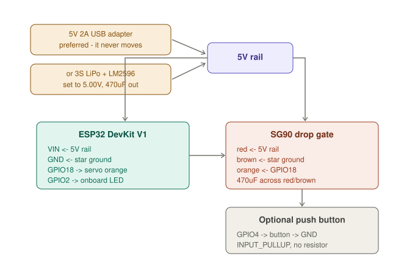

# Dispenser Wiring

## 1. Dispenser — complete wiring

### 1.1 Pin table

| ESP32 pin | GPIO | Direction | Connects to |
|---|---|---|---|
| `D18` | 18 | Output PWM | SG90 orange |
| — | 2 | Output | Onboard blue LED (no wiring) |
| `D4` | 4 | Input | *Optional* push button → GND |
| `VIN` | — | Power in | 5V rail |
| `GND` | — | Ground | Star ground |

**Three wires total** for the base build. The simplest board in the project.

### 1.2 SG90 drop gate

| Wire | Connects to |
|---|---|
| Brown | Star ground |
| Red | 5V rail |
| Orange | GPIO18 |

**No level shifter needed here** — there is no I2C bus on this unit, so no BSS138 in the build, and SG90 clones trigger reliably on 3.3V PWM (input threshold ~2.5V). If yours is intermittent, add a 2N7000 on the signal line.

470µF across red and brown, close to the connector. **Never power the servo from the ESP32's `3V3` or `5V` pin.**

### 1.3 Heartbeat LED

Blink GPIO2 once per second when Wi-Fi is connected, fast while reconnecting, solid during a drop cycle. Costs nothing — no resistor, no wire — and it is the only way to tell whether the board is alive when the website stops responding.

GPIO2 is a strapping pin, but driving the onboard LED *after boot* is its standard use on this board and is safe.

### 1.4 Optional manual button

GPIO4 to one side of a momentary button, other side to ground, then `pinMode(4, INPUT_PULLUP)`. Idle HIGH, pressed LOW. **No external resistor** — the internal ~45kΩ pull-up handles it. Add 100nF across the terminals and debounce 50ms in software.

It is the only way to dispense if Wi-Fi drops mid-demo.

### 1.5 Drop gate mechanics

| Design | How | Trade-off |
|---|---|---|
| Sliding shutter | Horn drives a flat plate across the chute | Most reliable, needs a linkage |
| Rotating paddle | Horn itself is the gate | Simplest, one item at a time |

**Chute height:** high enough for the car to pass under, but keep the drop under ~15cm or the medicine bounces out. **Fit a funnel** at the bottom — it absorbs ±2cm of car positioning error and is the cheapest reliability gain in the whole build.
