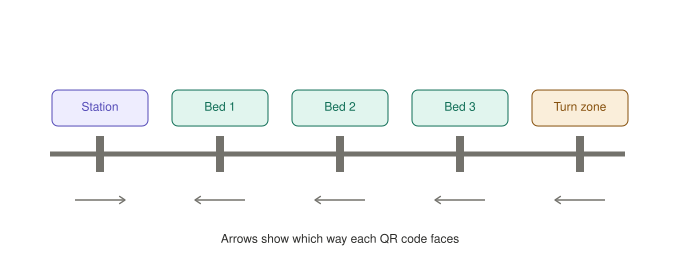

# Track and Navigation

## 1. Track layout and QR placement




```
[STATION]════●═══════●═══════●═══════●═══════════
              │       │       │       │      ↑
            Bed 1   Bed 2   Bed 3   Turn   15cm
                                    zone   spare line
```

`═` is the guide line. `●` is a perpendicular black strip spanning wider than the full array.

| Marker | Width | QR payload | QR faces |
|---|---|---|---|
| Station | 50mm | `STATION` | Toward the beds (seen on the return leg) |
| Bed 1…n | 30mm | `BED1`…`BEDn` | Toward the station (seen outbound) |
| Turn zone | 30mm | `TURNAROUND` | Toward the station (seen outbound) |

The camera faces the direction of travel, so each QR must face **toward the oncoming car**.

**Leave at least 15cm of guide line past the turn-zone marker.** Phase 1 of the spin creeps forward to clear the marker; if the tape ends there, the car drives onto bare floor and faults.

**Give the turn zone 25cm+ clearance on both sides.** With the caster at the front, the spin centre is the rear axle, so the whole front of the chassis sweeps an arc with a radius equal to the axle-to-front-corner distance.

**Put a physical bumper at the station** so the car parks in the same spot regardless of braking distance.

### 1.1 QR printing

- **At least 40×40mm.** Smaller and the OV2640 cannot resolve it at 15–25cm.
- **Matte paper, not glossy** — glossy reflects ceiling lights straight into the lens.
- Short payloads only: `BED1`, `STATION`. No URLs, no JSON — fewer modules, easier decoding.
- Mount at camera height, angled slightly toward the approach.
- Print `TURNAROUND` at the same size as the rest. It is the code the car relies on most — the only thing that gets it home when something else has gone wrong.

---

## 2. Navigation logic

### 2.1 The one rule

> Line-follow forward. When all five IR channels read black, stop. Capture a QR image. Act on whatever ID comes back.

No counters. No dead reckoning. No position variable. The car does not know or care where it is until a QR tells it.

**Why:** a counter is state that can drift. One slipped wheel and the car believes it is at bed 2 while standing at bed 3, with nothing detecting the error. With QR-only identity there is no such state to corrupt. The worst failure is that the car takes longer than expected — never that it delivers to the wrong patient.

### 2.2 Dispatch table

| Scanned ID | State | Action |
|---|---|---|
| `STATION` | Outbound with medicine | Ignore, resume |
| `STATION` | Returning | Stop. Enter `STANDBY`. |
| `BED<n>` where n == target | Outbound | Stop. Unlock sequence. |
| `BED<n>` where n ≠ target | Outbound | Resume driving |
| `TURNAROUND` | Outbound | Execute 180° spin, set `returning = true` |
| `TURNAROUND` | Returning | Should never happen — fault |
| Any | Returning | Ignore unless `STATION` |
| Nothing decoded | Any | Hand off to nurse manual verify |

The `TURNAROUND` row makes the missing-QR case free: if the target bed's code is damaged, the car keeps going, reaches the turn zone, spins, returns to `STATION`, and never unlocks. No separate end-of-line detection needed.

### 2.3 Marker debounce

- Require all-five-black for **at least 60ms** before treating it as a marker
- Require at least **300ms of not-all-black** before the next marker registers

Without this, one strip triggers several times.

### 2.4 Line following

Use a weighted position from all five channels. With sensors numbered 1–5 left to right and `b[i]` = 1 when black:

```
position = (1*b1 + 2*b2 + 3*b3 + 4*b4 + 5*b5) / (b1+b2+b3+b4+b5)
error    = position - 3.0
```

Feed `error` to a PID and apply the output differentially to the two motor PWMs.

**Start with a low proportional gain.** With the caster at the front, the array is far from the pivot, so a small heading error produces a large sensor swing. Tune P first with I and D at zero, then add a little D to damp overshoot.

---

## 3. The 180° spin

The car is standing **on** the all-black marker when it decides to turn. "Spin until the centre sensor finds the line" cannot work there — every sensor already reads black. And on the way back it immediately re-crosses that same marker.

| Phase | Action | Exit condition |
|---|---|---|
| 1 | Creep forward at 45% PWM to clear the marker | Sensors no longer all-black, ~5cm |
| 2 | Spin blind: left motor forward, right reverse, 55% PWM | 80% of calibrated 180° time |
| 3 | Continue spinning at **35% PWM** | Centre channel (`OUT3`) reads black |
| 4 | Stop both motors, settle | 200ms |
| 5 | Set `markerCooldown`, resume line following | 2000ms of ignoring all-black |

**Phase 5 is essential.** Without it the car re-detects the turn-zone marker one second after spinning and stops again, forever.

**Phase 3 runs slower than phase 2** because with the front-caster layout the array is far from the pivot and sweeps across the line quickly. At 45% it can pass the line between sensor reads.

### 3.1 Calibrating phase 2

1. Put the car on a clear patch of floor, off the line.
2. Command a spin at 55% PWM and time a full 180° by eye.
3. Repeat five times, average. Expect roughly 900–1200ms.
4. Set the blind phase to **80%** of that average.
5. Re-measure with a half-drained battery. Spin time stretches as the pack sags — which is exactly why phase 3 exists rather than trusting the timer alone.

Use 55% duty, not full speed. A fast spin overshoots and phase 3 never converges.

```cpp
const uint16_t SPIN_BLIND_MS      = 880;   // 80% of measured 1100ms
const uint8_t  SPIN_PWM           = 140;   // ~55% of 255
const uint8_t  SPIN_SLOW_PWM      = 90;    // ~35% of 255
const uint8_t  CREEP_PWM          = 115;   // ~45% of 255
const uint16_t MARKER_COOLDOWN_MS = 2000;
```
