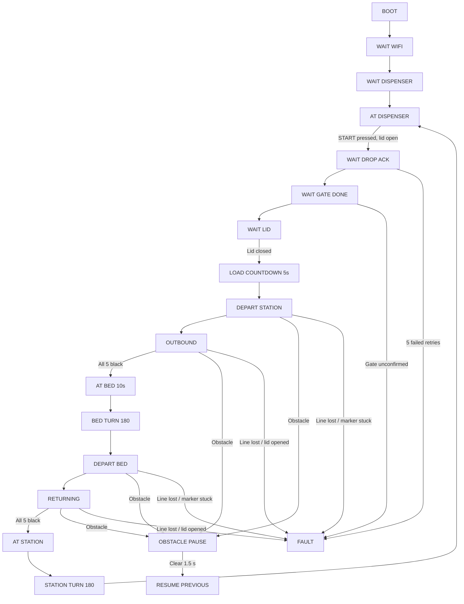

# Smart Hospital Medicine Robot Plan

**Version:** 2.1 (manual-lid rebuild, protocol locked)
**Date:** 2 September 2026
**Supersedes:** v1.4
**Scope:** One-bed prototype, two ESP32 DevKit V1 boards, one working servo total.

## 0. Why this is a new plan, not an edit

The glovebox servo is dead. Every automatic box-open and box-close step in v1.4 is gone, and with it the firmware interlock that stopped the car moving with the box open. The medicine box now has a lid that a person opens and closes by hand.

This is a net simplification. The car sketch now contains no servo code at all, which removes the LEDC timer conflict, the pulse-width calibration, the servo brownout risk, and four mission states. The dispenser keeps its servo and its duplicate-drop protection unchanged.

The car also no longer needs to remember its orientation between power cycles. In the new cycle it performs a 180-degree turn every time it reaches the dispenser, so it is always left facing the bed. The stored orientation flag from v1.4 is deleted.

Version 2.1 locks the inter-board wire format to a compile-checked 12-byte packet, adds build fingerprints and packet counters to both Serial Monitors, and fixes the obstacle pause so it continues sampling until the path is genuinely clear. The 15 cm caution band now actually selects creep speed.

### Two assumptions this plan rests on

1. **The dispenser servo still works.** The whole loading step depends on it. If it is also dead, section 20 describes the fully manual fallback.
2. **A lid switch will be fitted.** See section 5. If you cannot get one, section 5 also gives the button-only fallback and states plainly what safety property you lose.

## 1. Final concept

Two electronic units.

**Mobile unit (car + medicine box)** is the master controller. It joins the `froggy` hotspot, hosts the control website, follows the floor line, detects markers with the five-channel IR array, stops for obstacles with the HC-SR04, drives the LCD, buzzer and motors, reads the START button and the lid switch, and commands the dispenser over ESP-NOW.

**Fixed dispenser** is the receiver. It joins the same hotspot, receives ESP-NOW drop requests, opens its gate, drops one medicine package, closes the gate, and acknowledges.

No camera, no QR code, no PC application, no Internet.

## 2. The operating cycle in plain words

The car sits on the all-black station marker, directly under the dispenser outlet, facing the bed. The lid is open.

1. LCD shows `AT DISPENSER` / `Press START`. Buzzer gives the arrival pattern.
2. Operator presses START. The car sends a drop request to the dispenser.
3. The dispenser gate opens for its calibrated hold time, one package falls into the box, the gate closes, and the dispenser confirms.
4. LCD shows `MEDICINE DROPPED` / `Close the lid`.
5. Operator closes the lid by hand. The lid switch fires.
6. LCD shows `MEDICINE LOADED` / `Moving in 5s` and counts down.
7. After 5 seconds the car creeps forward off the station marker, picks up the line, and follows it.
8. When all five IR channels read black, that is the bed. The car stops, sounds the arrival pattern, and shows `ARRIVED AT BED 1` / `Take medicine` with a 10-second countdown.
9. After 10 seconds the car spins 180 degrees in place, still on the bed marker.
10. It creeps forward off the bed marker, picks up the line, and follows it back.
11. When all five channels read black again, that is the station. The car stops and shows `AT DISPENSER` / `Repositioning`.
12. It spins 180 degrees in place on the station marker so it faces the bed again, ready for the next round. LCD returns to `AT DISPENSER` / `Press START`.

The cycle then repeats from step 1.

## 3. Why the turns happen on the markers

Both 180-degree turns are done in place while the car is still sitting on the wide all-black marker. This matters for two reasons.

At the station it is the only option. The box has to stay under the dispenser outlet. If the car crept off the marker before turning, it would come back displaced and the medicine would miss the box.

At the bed it is the better option anyway. Turning in place keeps the pivot at the marker centre, so the car ends up on the same stretch of track it arrived on rather than somewhere further down the floor.

The consequence is that no line reacquisition is possible during the spin itself, because every sensor is over black the whole time. Reacquisition therefore happens after the turn, during departure: the car creeps forward until the array leaves the marker, and the normal line-following recovery takes over from there. Section 10 describes that recovery.

**Alignment rule that follows from this:** position the dispenser outlet so it sits over the medicine box when the car is parked on the station marker *after* the repositioning turn, not before it. Mark that spot on the floor during setup and check it every time.

## 4. Mission states

| State | What the car is doing |
|---|---|
| `BOOT` | Pins safe, hardware check, LCD and serial banner |
| `WAIT_WIFI` | Joining the hotspot, retrying every 10 s |
| `WAIT_DISPENSER` | Hotspot joined, waiting for a dispenser heartbeat that reports READY |
| `AT_DISPENSER` | Parked under the outlet, lid open, waiting for START |
| `WAIT_DROP_ACK` | Drop request sent, retrying up to five times |
| `WAIT_GATE_DONE` | Dispenser acknowledged, waiting for the gate-closed confirmation |
| `WAIT_LID` | Medicine dropped, waiting for the lid switch to report closed |
| `LOAD_COUNTDOWN` | Lid closed, 5-second countdown before departure |
| `DEPART_STATION` | Creeping forward off the station marker |
| `OUTBOUND` | Following the line toward the bed, marker detection armed |
| `AT_BED` | Stopped on the bed marker, 10-second patient window |
| `BED_TURN` | Blind 180-degree spin in place on the bed marker |
| `DEPART_BED` | Creeping forward off the bed marker |
| `RETURNING` | Following the line back, marker detection armed |
| `AT_STATION` | Stopped on the station marker, announcing arrival |
| `STATION_TURN` | Blind 180-degree spin in place, repositioning for the next load |
| `OBSTACLE_PAUSE` | Stopped by the sonar, movement timer paused |
| `FAULT` | Stopped, reason on the LCD, operator reset required |
| `EMERGENCY_STOP` | Motors off, manual reset required |

`DEPART_STATION` and `DEPART_BED` share identical logic and differ only in which travel state they hand off to.

## 5. The lid switch

This is the one part the plan asks you to add.

A lever microswitch or a magnetic reed switch mounted so the lid closes onto it. Wire it between the GPIO and GND and use `INPUT_PULLUP`, so **closed lid reads LOW** and **open lid reads HIGH**. Debounce in firmware over 50 ms.

What it buys:

- The 5-second countdown starts on the real physical event you described, not on a button click that only means somebody claims they closed it.
- The car refuses to leave `LOAD_COUNTDOWN` unless the lid actually reads closed.
- If the lid opens at any point during `DEPART_STATION`, `OUTBOUND`, `BED_TURN`, `DEPART_BED`, `RETURNING` or `STATION_TURN`, the car stops both motors immediately and enters a `LID OPEN` fault. This is the replacement for the interlock the dead servo used to provide.
- The dispenser drop is refused unless the lid reads open, so the gate never releases a package onto a closed lid.

**Fallback with no switch.** Set `LID_SWITCH_FITTED = false`. A CONFIRM button (web page, serial `k`, or the physical button pressed a second time) then stands in for the lid event. The countdown and the mission run exactly the same way. What you lose is real: the car will happily drive with the lid open if the operator confirms by mistake, and nothing will notice. Treat this as a bench-testing mode, not the demonstration configuration, and say so in your report.

## 6. Track design

- Centred black guide line 18 to 25 mm wide on a light, matte floor.
- A normal line is narrow enough that only the centre sensor sees black, or the neighbouring sensor during a correction.
- Each stop marker is a wide black rectangle spanning the full IR array with at least 20 mm spare on each side.
- Each marker must be deep enough in the driving direction that the whole array lands on it in one control-loop pass, and deep enough that the car can spin 180 degrees in place without any sensor leaving the black. This is a new requirement in v2.0 and it makes the markers larger than in v1.4. Size them from the array width and the wheelbase, then verify by spinning the car on the marker and watching the `IRBLK` column stay `11111` throughout.
- Leave clear floor around both markers at least the car's diagonal plus 10 to 15 cm.
- Station marker position: set it so the box sits under the dispenser outlet *after* the repositioning turn.
- Bed marker position: set it using the same array-to-box offset.
- Keep the floor matte. Gloss and direct sunlight destabilise reflective IR readings.

The tested sensor board reports raw HIGH on white and raw LOW on black. Firmware normalises with `black = !digitalRead(pin)` so `true` always means black.

## 7. Mobile-unit hardware allocation

| Function | ESP32 pin | Notes |
|---|---:|---|
| IR 1 far left | GPIO36 | Input only |
| IR 2 left | GPIO39 | Input only |
| IR 3 centre | GPIO34 | Input only |
| IR 4 right | GPIO35 | Input only |
| IR 5 far right | GPIO17 | Digital input |
| L298N ENA | GPIO14 | PWM, left motor speed |
| L298N IN1 | GPIO27 | Left direction |
| L298N IN2 | GPIO26 | Left direction |
| L298N IN3 | GPIO25 | Right direction |
| L298N IN4 | GPIO33 | Right direction |
| L298N ENB | GPIO23 | PWM, right motor speed |
| HC-SR04 TRIG | GPIO13 | Output |
| HC-SR04 ECHO | GPIO4 | Through 1 kΩ/2 kΩ divider, never direct |
| Active buzzer | GPIO19 | Transistor driver required |
| LCD SDA | GPIO21 | Through level shifter |
| LCD SCL | GPIO22 | Through level shifter |
| **START button** | **GPIO18** | **New. Freed by the dead servo. Button to GND, `INPUT_PULLUP`** |
| **LID switch** | **GPIO16** | **New. Switch to GND, `INPUT_PULLUP`, LOW means closed** |
| Spare | GPIO32 | Optional CONFIRM button in the no-switch fallback |

GPIO18 and GPIO16 are not strapping pins, so a switch held low at power-up cannot disturb the boot mode. Do not move these to GPIO0, 2, 5, 12 or 15 without checking the strapping table.

### PWM channel allocation

The car now has no servo, so there is no timer contention left to manage. Both motor channels are still pinned explicitly rather than auto-allocated, so nothing added later can silently take them.

| Output | GPIO | LEDC channel | Timer | Frequency | Resolution |
|---|---:|---:|---:|---:|---:|
| Left motor ENA | 14 | 0 | 0 | 1 kHz | 8 bit |
| Right motor ENB | 23 | 1 | 0 | 1 kHz | 8 bit |

Do not use the `ESP32Servo` library in the car sketch. There is nothing for it to drive, and adding it back would reintroduce the allocator clash that killed the previous build.

### Level shifting and protection

- ESP32 GPIO21 goes to an A-side channel, the matching B-side channel goes to LCD SDA. Same for GPIO22 and SCL.
- Shifter `VA` = 3.3 V, `VB` = 5 V, `OE` = 3.3 V, single GND to the star ground.
- Never connect 5 V LCD SDA or SCL directly to an ESP32 pin.
- HC-SR04 TRIG connects directly to GPIO13. ECHO goes through a 1 kΩ resistor to GPIO4, and GPIO4 goes through a 2 kΩ resistor to GND. This brings the 5 V echo down to about 3.3 V.

### Buzzer

The identified buzzer draws about 30 mA, which is too much for a GPIO. Use an NPN transistor such as 2N2222 or BC547, a base resistor around 1 kΩ, and a flyback diode across a magnetic buzzer. Until that driver exists, keep `BUZZER_ENABLED = false`. The firmware runs its patterns either way; only the physical output is muted.

This matters more in v2.0 than it did before, because the buzzer is now the main way the operator knows the car has arrived and needs attention. Fit the driver before the demonstration.

## 8. Fixed-dispenser hardware allocation

| Function | ESP32 pin | Notes |
|---|---:|---|
| Gate servo | GPIO18 | LEDC channel 4, timer 2, 50 Hz, 16-bit. Servo power from an external regulated 5 V rail |
| Optional test button | GPIO32 | Button to GND, `INPUT_PULLUP`, bench use only |
| Status LED | GPIO2 | Onboard |

Gate angles default to 20 degrees closed and 100 degrees open. Do not use 0 or 180: those map to the extremes of the pulse range where many SG90-class servos stall against a mechanical stop and draw continuous current. Calibrate with the horn disconnected using the serial sweep test and the nudge commands.

## 9. Power architecture

### Mobile unit

3S 11.1 V LiPo, master switch on the positive lead before the branch.

1. Battery positive, master switch, then split to both buck-converter inputs.
2. Battery negative to the star ground point.
3. Motor buck set to about 7.5 V, feeding the L298N motor supply. The L298N drop keeps the 3 to 6 V TT motors in range.
4. Logic buck set to a regulated 5.0 V, feeding ESP32 VIN, HC-SR04, LCD, and the 5 V side of the level shifter.
5. IR array stays on 3.3 V if that is the already-tested wiring.
6. Every ground returns to the same star point: battery, both bucks, L298N, ESP32, ultrasonic, IR array, LCD, level shifter, buzzer driver, and both switches.

Never power a motor from a GPIO or from the ESP32 3.3 V pin. Put 470 to 1000 µF of bulk capacitance on each noisy rail, close to the load. A fuse and a 3S low-voltage alarm remain strongly recommended.

The car's 5 V rail is quieter in v2.0 because there is no servo on it. If you were seeing brownout resets before, check whether they disappear now.

### Fixed dispenser

Regulated 5 V supply with headroom for the ESP32 and the servo. 5 V at 2 A is a reasonable minimum for one SG90-class servo. Feed ESP32 VIN and the servo in parallel, join all grounds, and put about 470 µF across 5 V and GND near the servo.

## 10. Line-following behaviour

Weighted five-sensor error:

| Sensor | Weight |
|---|---:|
| Far left | -2 |
| Left | -1 |
| Centre | 0 |
| Right | +1 |
| Far right | +2 |

Error is the weighted sum divided by the number of black sensors. Correction is proportional to that error and clamped.

Starting values, all to be tuned on the real car:

- Cruise PWM 140 to 160 out of 255.
- Correction limit 80 to 110, added to one wheel and subtracted from the other.
- Proportional control only at first. Add derivative only if oscillation survives lower speed and lower gain.
- Creep PWM about 105, used for marker departure.
- Spin PWM about 140.

Line-lost recovery runs in two phases. For the first 500 ms the car arcs gently in the last known direction. After that it pivots in place toward the last known direction, which sweeps a wider area without travelling further off course. If the line is still missing at 1200 ms the car stops and enters `LINE LOST`.

This recovery is what catches an imperfect 180-degree turn. There is no separate realignment state, because a turn that ends slightly off simply presents as a lost line during departure and gets corrected by the same code.

### Marker handling

- All five sensors black is a marker candidate. The car stops both motors immediately, then debounces for 80 ms while stationary. Because it is already stopped, the marker does not need to sustain 80 ms of travel.
- Marker detection is disarmed after every confirmed marker and after every turn. It re-arms only once the array has seen normal line conditions continuously for 300 ms.
- While disarmed and still over black, the car creeps forward. That creep has a 3-second timeout. This timeout matters: an IR array that loses power floats low, which normalises to all-black, and without the timeout the car would creep forward indefinitely with no fault.
- The direction of travel is what distinguishes the two identical markers. `OUTBOUND` means the next all-black is the bed. `RETURNING` means it is the station. This works only because there is exactly one bed on one route. Adding a second bed will require marker counting, different marker patterns, RFID, or another identification scheme.

## 11. Obstacle behaviour, and an honest note about 4 cm

You asked for a stop threshold under 4 cm. That is implemented, with one addition, because 4 cm on its own does not work as a stopping distance.

### The problem

At a cruise PWM of about 145 the car covers roughly 5 to 15 cm per 100 ms depending on gearing and floor. The sonar samples on a fixed schedule and requires two consecutive close readings before it declares an obstacle, which is what stops a single noisy echo from halting the mission. Two samples plus motor and gearbox coast means the car needs more than 4 cm to stop from cruise speed. If the only threshold is 4 cm, the car will touch the obstacle before the motors cut.

The HC-SR04 has a second problem in this range. Its specified minimum is about 2 cm and readings below roughly 3 cm are unreliable. Worse, when a target is closer than the minimum the sensor usually returns no echo at all, and a no-echo reading is normally interpreted as "clear". At a 4 cm threshold that failure mode points the wrong way: an object pressed right against the sensor would read as clear floor.

### The design

Three distances instead of one.

| Name | Value | Behaviour |
|---|---:|---|
| `OBSTACLE_CAUTION_CM` | 15 | Reduce both motors to creep speed. The car keeps moving but is now slow enough to stop within a few centimetres |
| `OBSTACLE_STOP_CM` | 4 | Stop both motors, show `OBSTACLE!` / `CAR STOPPED`, sound the warning pattern |
| `OBSTACLE_RESUME_CM` | 8 | Resume only after the distance stays above this continuously for 1.5 s |

The caution band is what makes the 4 cm stop physically achievable. The gap between 4 and 8 provides hysteresis so the car does not chatter between stopped and moving.

Supporting rules:

- Sample every 50 ms rather than every 100 ms, with a 6 ms echo timeout. Six milliseconds still covers about a metre and avoids a 25 ms stall in the control loop when there is no echo.
- Require two consecutive close readings before declaring an obstacle.
- **Sticky close reading.** If the previous valid reading was at or below `OBSTACLE_CAUTION_CM` and the current reading times out, treat it as an obstacle rather than as clear, for up to five consecutive timeouts. This covers the too-close blind zone. After five, fall back to treating it as clear and log a warning, because a permanently silent sensor should not deadlock the mission.
- Stop both motor outputs to zero, never just one.
- Pause the active movement timer while obstructed so an interrupted state resumes with the correct time still to run.
- Do not monitor the sonar during either 180-degree spin. A forward-facing cone sweeps across whatever is beside the car during a spin, so readings there are not geometrically meaningful and would cause false stops. Monitoring is active during `DEPART_STATION`, `OUTBOUND`, `DEPART_BED` and `RETURNING`.
- The website provides an emergency stop, but autonomous obstacle stopping must never depend on the website being connected.

Measure the real number during Stage 5 testing: drive at cruise PWM toward a wall, note where it actually stops, and raise `OBSTACLE_CAUTION_CM` until the 4 cm stop is met without contact.

## 12. LCD and buzzer behaviour

16x2 display. Line 1 always carries the current state. Line 2 carries the countdown, distance, or instruction.

| State | Line 1 | Line 2 | Buzzer |
|---|---|---|---|
| `BOOT` | `SYSTEM BOOT` | `Checking parts` | One short beep |
| `WAIT_WIFI` | `WIFI RETRY` | `Hotspot: froggy` | None |
| `WAIT_DISPENSER` | `DISP OFFLINE` | `Retrying...` | One warning every 5 s |
| `AT_DISPENSER` (lid open) | `AT DISPENSER` | `Press START` | Arrival pattern once |
| `AT_DISPENSER` (lid shut) | `AT DISPENSER` | `Open the lid` | None |
| `WAIT_DROP_ACK` | `DISPENSING` | `Try n/5` | One beep on acknowledgement |
| `WAIT_GATE_DONE` | `DISPENSING` | `Gate closing` | None |
| `WAIT_LID` | `MED DROPPED` | `Close the lid` | Two short beeps |
| `LOAD_COUNTDOWN` | `MEDICINE LOADED` | `Moving in: 5s` | Beep each of the last 3 s |
| `DEPART_STATION` | `LEAVING DISP` | `Finding line` | None |
| `OUTBOUND` | `GOING TO BED 1` | `Dist:__cm IR:_` | None |
| `OBSTACLE_PAUSE` | `OBSTACLE!` | `Distance:__cm` | Repeated warning |
| `AT_BED` | `ARRIVED AT BED 1` | `Take med: 10s` | Arrival pattern, then a beep for each of the last 3 s |
| `BED_TURN` | `TURNING 180` | `Please clear` | None |
| `DEPART_BED` | `LEAVING BED 1` | `Finding line` | None |
| `RETURNING` | `RETURNING` | `Dist:__cm IR:_` | None |
| `AT_STATION` | `AT DISPENSER` | `Repositioning` | Completion pattern |
| `STATION_TURN` | `TURNING 180` | `Please clear` | None |
| `FAULT` | `FAULT` | fault reason | Triple warning every 5 s |
| `EMERGENCY_STOP` | `EMERGENCY STOP` | `Manual reset` | One long warning |

`ARRIVED AT BED 1` is exactly 16 characters, so it fits without truncation. If you add a second bed later, the text becomes `AT BED n` to stay inside the width.

The LCD is treated as optional. At boot the firmware checks the normal PCF8574 backpack ranges (`0x20`-`0x27` and `0x38`-`0x3F`), prioritising the common `0x27` and `0x3F` addresses, and disables all LCD writes if none responds. Without that guard a missing or miswired panel makes every write block on I2C timeouts inside the control loop.

## 13. Network architecture

Both boards join the phone hotspot by DHCP.

| Item | Setting |
|---|---|
| Wi-Fi name | `froggy` |
| Password | `Passwordki` |
| Car address | Assigned by the hotspot, printed at 115200 baud |
| Dispenser address | Assigned by the hotspot, not needed by the car |
| Control page | `http://<car-IP>` |

The website uses ordinary Wi-Fi. Inter-board commands use ESP-NOW broadcast packets on the hotspot's channel, so a changing subnet or DHCP lease cannot break dispenser control. Open the car's IP from a second device on the hotspot; some hotspot-host phones cannot browse their own clients.

The dispenser broadcasts a heartbeat once per second carrying its state and its most recently completed request ID.

### Locked ESP-NOW packet format

Both sketches use protocol version 2 and compile only if `sizeof(RadioPacket) == 12`. The definitions must remain identical.

| Offset | Field | Type | Bytes |
|---:|---|---|---:|
| 0 | `magic` (`0x4D454452`, `MEDR`) | `uint32_t` | 4 |
| 4 | `version` (`2`) | `uint8_t` | 1 |
| 5 | `type` | `uint8_t` | 1 |
| 6 | `deviceState` | `uint8_t` | 1 |
| 7 | `resultCode` | `uint8_t` | 1 |
| 8 | `requestId` | `uint32_t` | 4 |
| | **Total** | | **12** |

At boot the car must print `CAR-V2.1-P2-12B-20260902`, and the dispenser must print `DISP-V2.1-P2-12B-20260902`. Every dispenser heartbeat also prints `bytes=12 version=2`. If the car reports a 20-byte heartbeat, the transmitter is running an older or different binary; do not make the car accept unknown extra bytes. Flash the matched dispenser and car sketches and verify both fingerprints.

### Reliable command rules

Unchanged from v1.4, and still the most important part of the design.

- Every dispense command carries a unique `request_id`.
- The dispenser remembers the most recent accepted and completed IDs in non-volatile memory and must not dispense twice for the same ID.
- The car retries up to five times if no acknowledgement arrives.
- The car does not advance to `WAIT_LID` until it has confirmation that the gate closed. The dispenser repeats its latest completed ID in every heartbeat, so a lost one-time `DONE` packet does not stall the system.
- A matching completion packet or completed-ID heartbeat also counts as proof of acceptance if every acknowledgement was lost.
- If all retries fail, the car stays put and shows `NO DISPENSER ACK`. It must never behave as though medicine was loaded.
- If a dispenser reset interrupts a drop, its physical outcome is unknown. The dispenser closes its gate at boot, enters `DROP INTERRUPTED`, blocks the old request ID permanently, and requires operator inspection.
- The mission continues locally if the phone disconnects from the webpage.

## 14. Website and buttons

The car serves a single page that polls `/status` about every 500 ms. All timing and safety logic lives in the firmware, not in browser JavaScript. Closing the page must not interrupt or corrupt a mission.

Page contents: large START button, always-visible red emergency stop, reset fault, a CONFIRM LID button used only in the no-switch fallback, a protected dispenser test button, and live telemetry showing state, dispenser link, lid state, countdowns, five IR readings, sonar distance, motor PWM and last error.

| Method and route | Purpose |
|---|---|
| `GET /` | Control website |
| `GET /status` | JSON telemetry |
| `POST /start` | Request a drop, valid only in `AT_DISPENSER` with the lid open |
| `POST /lid/confirm` | Stand in for the lid switch in fallback mode |
| `POST /abort` | Emergency stop |
| `POST /fault/reset` | Return to `AT_DISPENSER` after inspection |
| `POST /dispenser/test` | Setup-only one-shot drop |

Dispenser diagnostic endpoints stay as they were: `GET /status`, `POST /drop`, `POST /gate/open`, `POST /gate/close`, `POST /gate/test`, `POST /fault/reset`.

The physical START button on GPIO18 does exactly what the web START button does, with the same preconditions. In fallback mode a second press of the same button acts as the lid confirmation, and the LCD tells the operator which press it is expecting.

## 15. Firmware state machine

Implementation must be non-blocking. Use `millis()` state timing rather than long `delay()` calls so HTTP servicing, LCD updates, emergency stop, sonar monitoring and radio retries all stay responsive.

An emergency stop from any state sets both motor PWM values to zero immediately and cancels all later automatic movement.

## 16. Fault handling

| Failure | Required response |
|---|---|
| Dispenser unreachable | Refuse START, remain stopped, `DISP OFFLINE` |
| No acknowledgement after five attempts | Cancel loading, `NO DISPENSER ACK` |
| Gate closure never confirmed | `GATE UNCONFIRMED` after a 5 s grace period |
| Duplicate network request | Dispenser acknowledges but does not drop again |
| Dispenser resets during a drop | Close gate at boot, `DROP INTERRUPTED`, block the old ID, require inspection |
| START pressed with the lid closed | Refuse, prompt `Open the lid` on the LCD |
| **Lid opens while the car is moving** | **Stop both motors immediately, `LID OPEN` fault** |
| Lid never closes | No timeout. The car waits indefinitely in `WAIT_LID`, which is correct: an operator may have walked away, and there is nothing unsafe about waiting |
| Line lost longer than 1200 ms | Stop, `LINE LOST` |
| Marker creep never clears in 3 s | Stop, `MARKER NOT CLEARED`. Usually means the IR array lost power |
| Obstacle detected | Pause, resume only after stable clearance |
| Sonar times out repeatedly while close | Treat as obstacle for five samples, then log and treat as clear |
| Car resets mid-mission | Boot stopped in `REPOSITION CAR`. Operator returns the car to the station facing the bed and resets |
| Non-volatile memory init or write fails | Stop in an NVS fault. Do not move or dispense without duplicate protection |
| Motor PWM channel fails to attach | Stop in `PWM INIT FAILED` |
| Brownout or watchdog reboot | Boot with motor pins LOW, require recovery inspection instead of resuming |
| Website disconnects | Continue the local mission safely |
| Emergency stop | Motors off immediately, manual reset |

Because the car always faces the bed after a completed cycle, recovery from a mid-mission reset is simpler than in v1.4. There is no orientation flag to correct. Put the car back on the station marker facing the bed, press reset, and continue.

## 17. Serial component monitor

Both boards print one self-describing live row per sample, with the legend repeating every 20 rows. Every component sits on the same row, and a failed part shows as `FAIL`, `NO`, or a value that stops changing.

Car values: uptime, state, fault, Wi-Fi RSSI and channel, ESP-NOW init/peer/callback health, last RX and TX byte counts, raw/valid/bad packet counters, dispenser state and heartbeat age, IR raw and normalised patterns, black count, marker armed, sonar raw and acted-on distances, sonar timeout count, obstacle mode, motor PWM attachment and left/right commands, **manual lid state**, **START button state**, buzzer configuration/requested output, LCD address/presence, current request ID, and `nvs=n/a` because V2 stores no car state.

Dispenser values: uptime, state, fault, Wi-Fi RSSI and channel, radio health, last RX/TX byte counts, raw/valid/bad packet counters, heartbeat and TX queue counts, commanded gate state, servo PWM/signal state, angle, pulse width in microseconds, status LED, configured and raw test-button state, NVS health, active/accepted/completed request IDs, completed drop count, and the interrupted-request flag.

Serial commands on both boards: `h` help, `p` full vertical report, `i` toggle the monitor, `+` and `-` change the interval between 100 and 2000 ms, `w` Wi-Fi details. Car adds `s` START, `k` lid confirm, `a` emergency stop, `r` fault reset, `m` `1` `2` motor tests, `t` spin test, `b` buzzer test. Dispenser adds `g` gate sweep self-test, `d` local drop, `o` `c` `x` gate open, close and emergency close, `n` release servo, `[` and `]` angle nudge, `r` fault reset.

The car has no servo columns because its glovebox servo is intentionally absent. `lid=manual` identifies the configured fallback; with a switch fitted it reads `SHUT` or `OPEN`. The START button reads `DOWN` or `up`. The buzzer reads `MUTED` until `BUZZER_ENABLED` is set true after its transistor driver is fitted.

## 18. Values that must be calibrated

Structure is settled. These physical numbers cannot be guessed.

- Left and right motor polarity.
- Left and right PWM trim for straight motion.
- Cruise PWM and creep PWM.
- Line-following proportional gain and correction limit.
- `SPIN_180_MS`, the blind 180-degree spin duration. Start around 1100 ms and recalibrate on the assembled chassis. The car is lighter now without the box servo and linkage, so the old figure will not carry over.
- `OBSTACLE_CAUTION_CM`. Start at 15 and raise it until a cruise-speed approach reliably stops before 4 cm.
- Marker size, checked by spinning in place and confirming the IR pattern stays `11111` throughout.
- Station marker position, set so the box sits under the outlet after the repositioning turn.
- Bed marker position, using the same array-to-box offset.
- Dispenser gate closed and open angles, found with the horn disconnected.
- Dispenser gate open hold time. Start at 1.5 s.
- Lid switch polarity, verified in the monitor before anything else is wired to it.

## 19. Build and test order

Do not run the whole sequence for the first time with real medicine in the box.

### Stage 1, boards and power

1. Confirm both DevKits accept a simple sketch through their own USB ports.
2. Set each buck converter with no ESP32 connected.
3. Verify the 7.5 V motor rail, the 5.0 V logic rail, and every ground.
4. Power each ESP32 without motors and check for resets.

### Stage 2, car components

Open the serial monitor at 115200 baud. The live monitor starts automatically. Press `p` for the full report at any point.

1. Confirm the boot log shows `Motor ENA ch0=OK ENB ch1=OK`.
2. I2C scan and LCD check. A missing panel is reported and disabled rather than stalling the loop.
3. IR raw and normalised output over white floor, black line, and a wide marker. Watch `IRRAW` and `IRBLK`.
4. Sonar live distance. Verify the reading at 4, 8, 15 and 50 cm, and deliberately place an object at 1 cm to confirm the sticky-close rule reports an obstacle instead of clear.
5. Left and right motor tests with the wheels lifted.
6. **Lid switch check.** Open and close the lid and watch the `LID` column flip between `OPEN` and `SHUT`. Do this before wiring anything else that depends on it.
7. **START button check.** Watch the `BTN` column.
8. Buzzer driver test, once the transistor is fitted.

### Stage 3, dispenser

1. Confirm the boot log shows `Gate LEDC ch4 ... OK`.
2. Calibrate closed and open angles with the linkage disconnected, using `g` and the nudge keys.
3. One complete open, hold, close cycle with `d`.
4. Send the same request ID repeatedly and confirm only one physical drop.
5. Reset the dispenser during opening, hold, and closing. Every case must close at boot and require inspection without repeating the old request.
6. Leave a manual open running and confirm it auto-closes after 60 s.

### Stage 4, network

1. Connect a second device to `froggy`.
2. Open the car IP printed in the serial monitor and verify live telemetry.
3. Confirm the car reports dispenser heartbeats as READY.
4. Run one dry START to lid-close sequence with an empty box.

### Stage 5, motion

1. Tune low-speed line following with no markers on the track.
2. Verify the all-black marker debounce.
3. Calibrate `SPIN_180_MS` by spinning on a marker and checking the car ends within a few degrees of reversed.
4. Verify marker departure and line pickup after each turn.
5. Calibrate the bed stop position.
6. Verify return travel and the station stop.
7. Verify the repositioning turn leaves the box under the outlet.
8. Measure real stopping distance at cruise PWM and set `OBSTACLE_CAUTION_CM`.
9. Verify obstacle pause and stable automatic resume.
10. Deliberately trigger line lost, marker stuck, lid open during travel, and emergency stop.
11. Reset the car during each phase. Every case must reboot stopped in recovery fault.

### Stage 6, integration

1. Run the full cycle with an empty box.
2. Run it with a harmless lightweight object.
3. Complete at least five consecutive cycles with no duplicate drops, missed markers, line loss, or resets.
4. Only then demonstrate with packaged medicine.

## 20. Fallback if the dispenser servo is also dead

If both servos are gone, the automatic drop disappears and the project becomes a delivery robot with manual loading. The change is small:

- Delete `WAIT_DROP_ACK` and `WAIT_GATE_DONE`. `AT_DISPENSER` goes straight to `WAIT_LID` on the START press, with the LCD showing `LOAD MEDICINE` / `Close the lid`.
- The dispenser board is no longer needed. Delete the ESP-NOW dependency and the `WAIT_DISPENSER` state, and the car boots straight from `WAIT_WIFI` to `AT_DISPENSER`.
- Everything else, including the whole navigation cycle, the lid interlock, the sonar behaviour and the monitor, is unchanged.

Say clearly in your report that loading is manual in this configuration. It is a smaller contribution but an honest one, and it still demonstrates autonomous navigation, marker recognition, obstacle avoidance and a safety interlock.

## 21. Acceptance criteria

The prototype is ready when all of these hold.

- One START press begins the load sequence. No PC script is required.
- The dispenser cannot release twice from one command.
- A reboot or a failed persistent-memory write cannot bypass duplicate-drop protection.
- The car does not leave the dispenser until the gate is confirmed closed and the lid is confirmed shut.
- With a lid switch fitted, the car stops immediately if the lid opens in motion.
- The car refuses to move when the dispenser command fails.
- Bed and station markers are correctly distinguished by travel state.
- Both 180-degree turns complete on their markers and the car reacquires the line on departure.
- After the repositioning turn the box sits under the dispenser outlet, repeatably.
- Obstacle detection always sets both motor outputs to zero, and the car stops before 4 cm without contact.
- Emergency stop works in every active state.
- The LCD always shows the current state and any fault, and a missing LCD degrades gracefully.
- Every component reports a live value in the serial monitor during a mission.
- Five complete consecutive cycles succeed.

## 22. Confirmed operating decisions

1. Exactly one bed on one straight or continuous route.
2. Both stop markers are identical wide all-black rectangles. `OUTBOUND` means bed, `RETURNING` means station.
3. The medicine box lid is opened and closed by hand. There is no box servo.
4. Both 180-degree turns happen in place on a marker, and both markers must be large enough for that.
5. The car performs a repositioning turn on every arrival at the station, so it always ends facing the bed. No stored orientation flag is needed.
6. The 5-second departure countdown starts when the lid is confirmed closed.
7. The bed window is 10 seconds.
8. The obstacle stop threshold is 4 cm, supported by a 15 cm caution band and an 8 cm resume threshold.
